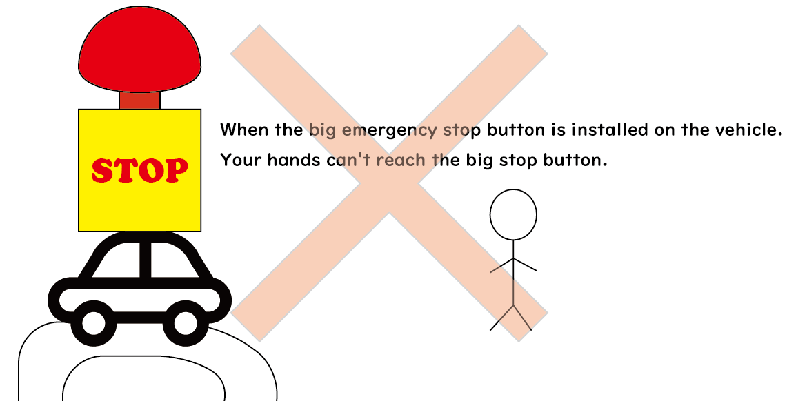
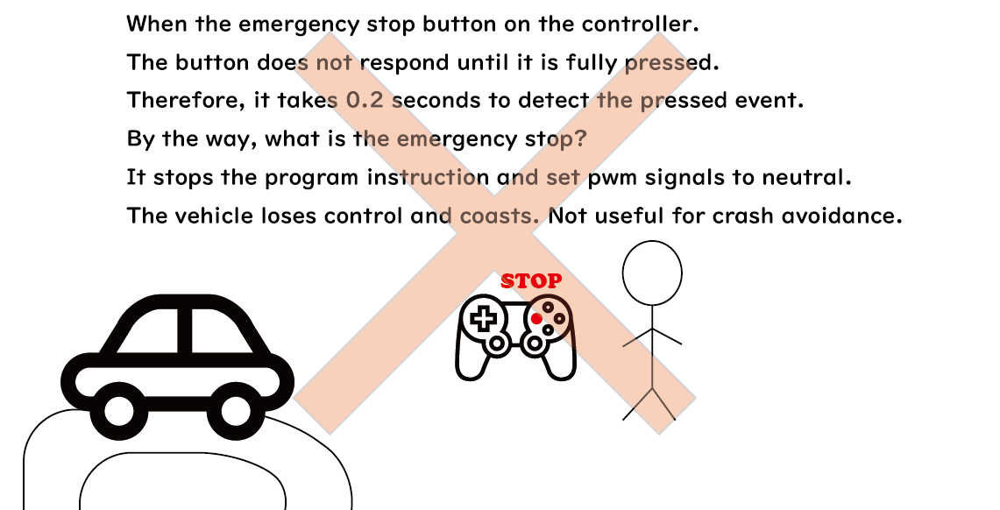
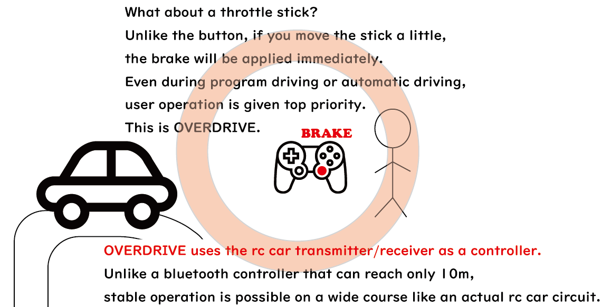
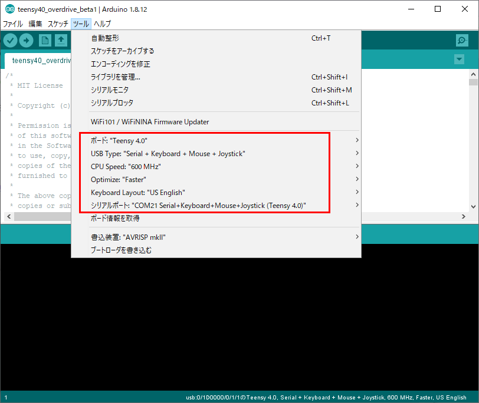
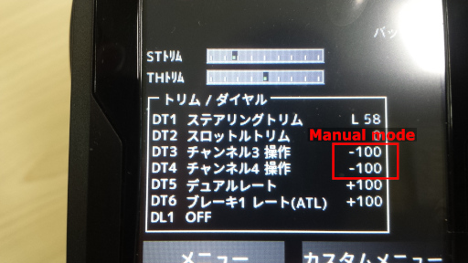
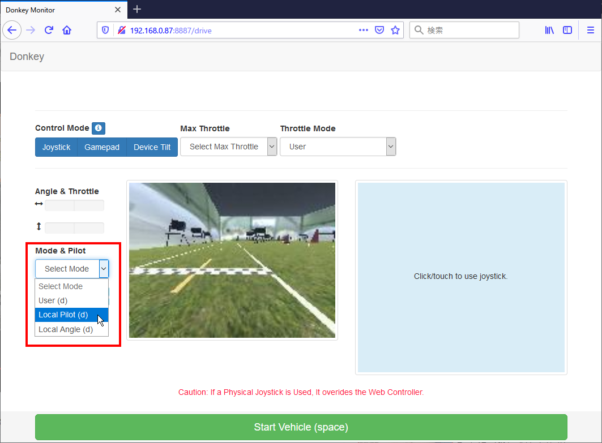
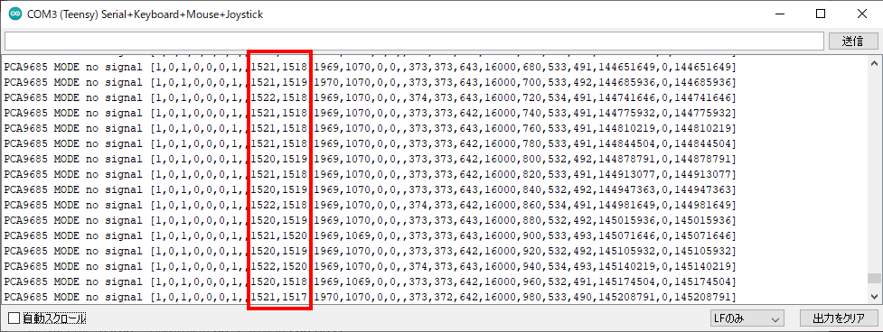

# OVERDRIVE

Teensy 4.0 RC/LED Controller


## Why we need OVERDRIVE?
The main function of OVERDRIVE is to switch between the PWM signal provided by the program and the PWM signal provided by the receiver.

The field of autonomous driving is still in a developing status. Under development, the vehicle may run out of control or crash due to various reasons such as programming mistakes, misrecognition, misjudgment, and freezes due to poor contact. Also, even if it works properly, other vehicles may hit your vehicle during the race. When you foresee danger, the big red emergency stop button will unfortunately be out of reach. 

The main purpose of OVERDRIVE is to provide the ability to stop immediately when you want to make an emergency stop.
Your manual control takes precedence over autonomous driving and applies to the vehicle. That's why I named this, OVERDRIVE. 

WiFi is commonly used for programmatic remote vehicle control. However, WiFi has a short communication distance and does not work at all in crowded event venues. Therefore, vehicle control using the R/C system, which has been fighting this crosstalk problem for many years, is useful.

OVERDRIVE makes both R/C system and autonomous driving system compatible.

Bad pattern:


Bad pattern:


Good pattern:



## Table of contents
*   Youtube
*   Teensyduino setup
    *   Install Arduino IDE
    *   Install Teensyduino
    *   Install teensy4_i2c
    *   Setup Arduino IDE
*   Teensy 4.0 OVERDRIVE  
    *   beta1
    *   beta2 (working on)
    *   Known issues
*   R/C system
    *   4ch Transmitter setup
    *   3ch Transmitter setup
*   DonkeyCar 4.3 overdrive
    *   Simulator setup
    *   RC Car setup
    *   Data collection
    *   Training
    *   Autonomous driving
*   PWM Calibration
    *   Enable DEBUG
    *   Adjustment the fluctuation width of the neutral pulse.
    *   What to do if the vehicle moves when the transmitter is off.


## Youtube
[](https://www.youtube.com/watch?v=P3-7nB2ac9M)
[](https://www.youtube.com/watch?v=KkKSrlPk_vg)
[](https://www.youtube.com/watch?v=DUpsCdNJ-Tc)

<hr>

## Teensyduino setup
[Arduino IDE](https://www.arduino.cc/en/main/software)<br>
[Teensyduino](https://www.pjrc.com/teensy/td_download.html)<br>
[teensy4_i2c](https://github.com/Richard-Gemmell/teensy4_i2c)<br>
*   Install Arduino IDE
*   Install Teensyduino
*   Install teensy4_i2c
*   Setup Arduino IDE

#### Install Arduino IDE
Download ARDUINO 1.8.13 Windows ZIP file for non admin install.<br>
unzip it.<br>

#### Install Teensyduino
Download Teensyduino 1.53 Windows 7/8/10 Installer.<br>
execute and install.<br>

#### Install teensy4_i2c
git clone and copy the directory into arduino libraries.<br>
```
git clone https://github.com/Richard-Gemmell/teensy4_i2c
cp -r teensy4_i2c arduino/hardware/teensy/avr/libraries/
```

#### Setup Arduino IDE
*   Tools

```
Board: "Teensy 4.0"<br>
USB Type: "Serial + Keyboard + Mouse + Joystick"<br>
CPU Speed: "600 MHz"<br>
Optimize: "Faster"<br>
```


<hr>


## Teensy 4.0 OVERDRIVE
The difference between beta1 and beta2 lies in the difference in design concept.  
beta1 is sufficient for most people. However, it is not enough for me who wants to install a lot of LEDs. 
#### Teensy 4.0 OVERDRIVE beta1
See [Teensy 4.0 OVERDRIVE beta1](./README_teensy40_overdrive_beta1.md)<br>

#### Teensy 4.0 OVERDRIVE beta2
In order to eliminate the need for the power supply of the car battery when using the simulator, I added pins to supply 5V power to the receiver.
*   Breadboard
    *   Added more LEDs.
    *   Added simulator pins to power the receiver.
    *   Added pins for a hall effect sensor.
    *   Moved some signal pin number.
*   Firmware
    *   Signal pin number is changed.

#### Known issue
*   sometime i2c error occures with PCA9685 emulator.  
Some motors seem to be affected by noise. (maybe tired dc motor)<br>
    *   If you feels bad signal with throttle on, try polishing the commutator and brush of the motor.<br>

<hr>

## R/C system
To use OVERDRIVE, you need a 3ch or 4ch transmitter and receiver.  
Especially when collecting data for autonomous driving, 4ch T/R is quite useful. 
*   4ch Transmitter setup
*   3ch Transmitter setup

#### 4ch Transmitter setup
Steering and throttle: These are normal rc car setup.<br>
For Futaba 7PX, assign buttons to 3ch and 4ch.<br>
*   ch1: steering
*   ch2: throttle
*   ch3: manual - auto mode change.
*   ch4: (donkeycar) delete records for 1 second. (To be exact, delete the number of fps=60.)

Futaba 7PX<br>
<br>
<br>
<br>

<hr>

#### 3ch Transmitter setup
Steering and throttle: These are normal rc car setup.<br>
*   ch1: steering
*   ch2: throttle
*   ch3: manual - auto mode change.

Tamiya TTU-08 (FINESPEC 2.4G)<br>
<br>
<br>

<hr>

## DonkeyCar 4.3 overdrive
#### Simulator setup
ALIENWARE is one of the best choice for training PC.  

Requirement:
*   Ubuntu >= 16.04
*   nvidia-docker2
*   nvidia GPU

**Install donkeycar simulator (on PC)**
```
cd ~/
wget https://github.com/tawnkramer/gym-donkeycar/releases/download/v21.04.15/DonkeySimLinux.zip
unzip DonkeySimLinux.zip
chmod 755 DonkeySimLinux/donkey_sim.x86_64
```

**Launch Simulator (on PC)**
```
./DonkeySimLinux/donkey_sim.x86_64
```
<hr>

##### PC docker

**Docker (on PC)**

First time 
```
sudo ./docker/run-donkeycar-pc.sh
```

If you already have a container
```
# check docker container id
sudo docker ps -a
# start docker container (The CONTAINER_ID can be omitted. ex: 8a51b203e939 is 8a)
sudo docker start CONTAINER_ID
# login
sudo docker exec -it CONTAINER_ID /bin/bash
```
docker image update
```
sudo docker pull naisy/donkeycar-pc:overdrive4
sudo ./run-donkeycar-pc.sh
```

<hr>

#### RC Car setup
*   Jetson Nano docker
*   PC docker

<hr>

##### Jetson Nano docker
**Docker (on Jetson)**

First time 
```
sudo ./docker/run-donkeycar-jetson.sh
```

If you already have a container
```
# check docker container id
sudo docker ps -a
# start docker container (The CONTAINER_ID can be omitted. ex: 8a51b203e939 is 8a)
sudo docker start CONTAINER_ID
# login
sudo docker exec -it CONTAINER_ID /bin/bash
```
docker image update
```
sudo docker pull naisy/donkeycar-jetson:overdrive4
sudo ./run-donkeycar-jetson.sh
```

<hr>

##### PC docker

**Docker (on PC)**

The same as simulator.

First time
```
sudo ./docker/run-donkeycar-pc.sh
```

If you already have a container
```
# check docker container id
sudo docker ps -a
# start docker container (The CONTAINER_ID can be omitted. ex: 8a51b203e939 is 8a)
sudo docker start CONTAINER_ID
# login
sudo docker exec -it CONTAINER_ID /bin/bash
```
docker image update
```
sudo docker pull naisy/donkeycar-pc:overdrive4
sudo ./run-donkeycar-pc.sh
```

<hr>

#### Data collection
Drive rc car at least 5 minutes.  
For a wide course such as a rc circuit, drive for an hour.  

```
# Jetson Nano
cd ~/mycar
python manage.py --js
```

1.  Transmitter ch3 auto mode.
2.  Transmitter ch3 manual mode. (change from auto to manual mode is one of flags)
3.  Transmitter ch2 throttle on. (start recording)
4.  Transmitter ch3 auto mode. (stop recording)
5.  Transmitter ch4 delete records. (delete 60 records.)

Tips:  
> If you make mistake during data collection.  
> 1. Switch to auto mode to stop recording.  
> 2. Then press the delete button several times.  
> 
> You can delete the missed data.  
> Press the delete button once to delete 1 second of data. (delete 60 records).

> When the battery voltage drops, you will be able to grip more throttle. As a result, using a fully charged battery during autonomous driving will drive at high speeds and lead to accidents.  
> You need to pit in frequently to keep the battery voltage constant.

<hr>

#### Training
Training executes on the training PC.  
It is assumed that the data collected by Jetson Nano is compressed into a zip and sent to the PC with the scp command. 

*   future prediction  
Inference is delay.  
The image sensor of the camera collects light and transfers the data to the CPU memory at 60 FPS. The image data is calibrated, cut off by region of interest (ROI), and transferred to GPU memory. Then inference is performed and the result is written to the register of PCA9685 chip. PWM signals are output from the PCA9685, and the servo and the motor start to work.  
There is no "no delay" here.  
Therefore, you will predict the future. It simply slides the collected training data image and steering/throttle values by 100ms.  
Why 100ms? Because the result was the best.  

```
# Training PC
cd ~/mycar
python train.py --model=linear.h5 --tub=data
```
After training, copy the model file to jetson nano with scp command.

<hr>

#### Autonomous driving
Autonomous driving has been changed to use TensorRT.  
(Tensorflow/Keras linear model is still available)  
Before run this, set the transmitter in manual mode.
```
# Jetson Nano
# make pb
cd ~/mycar
python ~/projects/donkeycar/scripts/freeze_model.py --model=linear.h5 --output=linear.pb

# make uff
python /usr/lib/python3.6/dist-packages/uff/bin/convert_to_uff.py linear.pb

# autonomous driving
python manage.py drive --model=linear.uff
```
1.  Wait until the camera resolution log is displayed in the terminal.
2.  Access the following URL with a web browser on your PC.  
`http://jetson_nano_ip_address:8887`  
3.  Select `Mode & Pilot` to `Local Pilot (d)`  
4.  Press transmitter 3ch to switch to auto mode.  
5.  Use the transmitter brake immediately if you feels denger, strange or crash. Overdrive gives priority to manual operation.  
When you release throttle and steering, autonomous driving will resume after 1 second.

<br>

<hr>

## PWM Calibration
#### Enable DEBUG
OVERDRIVE requires a precise definition of the neutral signal. This is because it is judged that signals outside the neutral range are manually operated. 

First, enable serial output for debugging.  
[teensy40_overdrive_beta1/teensy40_overdrive_beta1.ino](teensy40_overdrive_beta1/teensy40_overdrive_beta1.ino)
```
#define DEBUG 1
```
By using the arduino ide serial monitor, you can check the PWM signal values sent from your receiver.  
In the following example, you can see that the values of 1ch and 2ch of the rc receiver are as follows.  
<br>
1ch: 1521 +-1  
2ch: 1519 +-2  

Write this value as a neutral value. 
```
const int RECV_CH1_PULSE_LENGTH_MIN     = 1000; // maximum steering right value
const int RECV_CH1_PULSE_LENGTH_NEUTRAL = 1521; // neutral steering value
const int RECV_CH1_PULSE_LENGTH_MAX     = 2000; // maximum steering left value
const int RECV_CH2_PULSE_LENGTH_MIN     = 1000; // maximum throttle forward value
const int RECV_CH2_PULSE_LENGTH_NEUTRAL = 1519; // neutral throttle value
const int RECV_CH2_PULSE_LENGTH_MAX     = 2000; // maximum throttle brake value
```

There is no problem with the maximum and minimum values remaining at 1000 and 2000.  
You can set it in detail, but it only adds to the annoyance.  
With 1000 and 2000 for minimum and maximum, even if the actual pwm pulse used is between 1250 and 1750, it can be covered without any problem.  
Just set the PCA9685 setting in DonkeyCar's myconfig.py to a value that gives 1000us and 2000us.
```
STEERING_LEFT_PWM = 483           # 1000us
STEERING_RIGHT_PWM = 263          # 2000us

THROTTLE_FORWARD_PWM = 483       # 1000us
THROTTLE_STOPPED_PWM = 373       # 1520us
THROTTLE_REVERSE_PWM = 263       # 2000us
```
When training neural networks, it is expected that it will be beneficial to set minimum and maximum in detail so that -1.0 to 1.0 can be clearly used. However, in reality, I can run on 1000 and 2000 without any problem.  

Check the code for more information on the output of the serial monitor. 
<br>

#### Adjustment the fluctuation width of the neutral pulse
Change the value of NEUTRAL_PULSE_IGNORE_THRESHOLD in the following cases.  
1ch: 1521 +-5  
2ch: 1519 +-5  
```
/*
 * Neutral pulse noize cancel
 */
#define NEUTRAL_PULSE_IGNORE_THRESHOLD 5 // NEUTRAL +- 5us will be neutral. This is for noize cancel.
```
The default is 3.  
When a signal that exceeds this threshold is detected, it is determined that manual operation has been performed, and the system shifts to overdrive mode. 

The sensor on the transmitter wears out.  
Therefore, if you feel something is wrong with the operation, enable debugging and check the neutral PWM value.  


#### What to do if the vehicle moves when the transmitter is off.
Depending on the receiver, the receiver may send the wrong neutral value when the transmitter is off.  

Normal case:
```
1. The transmitter is in neutral with the 1500.
2. The receiver receives the 1500 from the transmitter and outputs the 1500 PWM signal.
3. The ESC has the 1500 in neutral.
4. At this time, the motor is stopped.
```

However, the following cases are very dangerous.
```
1. Turn off the power of the transmitter.
2. The receiver outputs 1508.
3. ESC receives 1508 as a step forward.
4. The motor rotates and the vehicle moves forward.
```
This is especially dangerous for vehicles with special equipment such as snowplows.  
For such devices, it is recommended that you read the instructions carefully and set the receiver neutral value correctly. 

OVERDRIVE allows you to enable USE_RECV_CUTOFF as a function to cut off the output in such cases.
```
#define USE_RECV_CUTOFF 1      // 0: For receivers that turn the signal off when the transmitter is off, like the R334SBS-E. 1: For receivers that send a neutral signal when the transmitter is off
```

Set RECV_CH2_PULSE_LENGTH_NEUTRAL and NEUTRAL_PULSE_IGNORE_THRESHOLD to cover both the neutral value (1500) when the transmitter is on and the neutral value (1508) when the transmitter is off. 
```
const int RECV_CH2_PULSE_LENGTH_NEUTRAL = 1504; // neutral throttle value

#define NEUTRAL_PULSE_IGNORE_THRESHOLD 10 // NEUTRAL +- 10us will be neutral. This is for noize cancel.
```

This will set the PWM signal to 0 when it stays in the neutral range for 0.5 seconds. As a result, you can stop the phenomenon of slow forward when the transmitter is turned off.
```
unsigned long micros_cutoff = 500*1000; // 500ms
```
