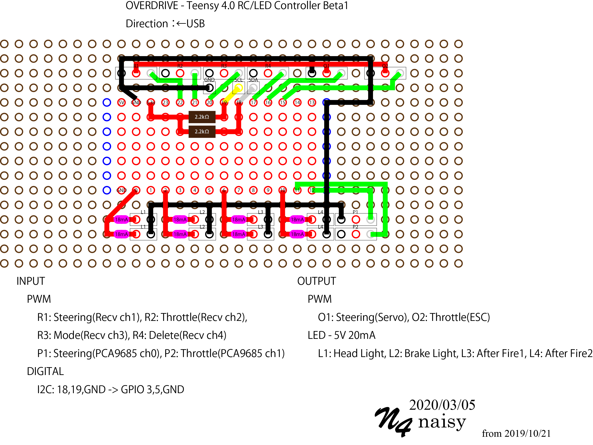
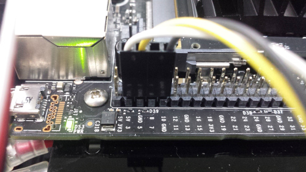
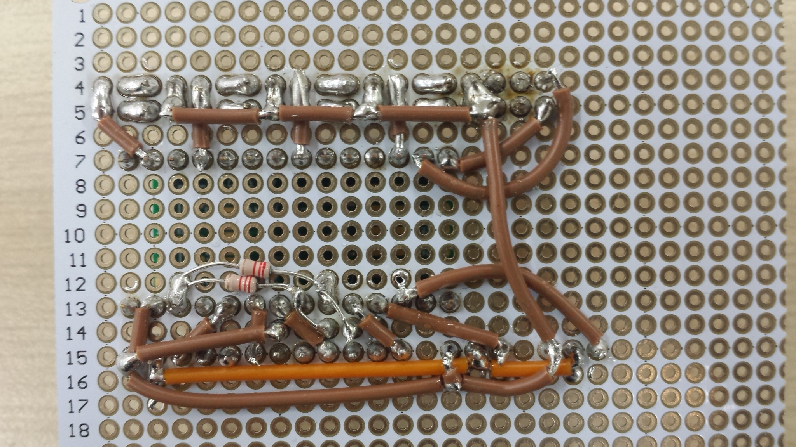

# Teensy 4.0 OVERDRIVE beta1

## Breakout Board
<br>

## Code
[teensy40_overdrive_beta1/teensy40_overdrive_beta1.ino](./teensy40_overdrive_beta1/teensy40_overdrive_beta1.ino)

## Wiring
In these pictures, LED soldering is not yet complete.<br>
<br>
<br>
<br>
<br>

## Tuning
Using an oscilloscope, enter the time (in microseconds) during which the voltage is HIGH.<br>
<b>Important:</b><br>
* MIN is minimum pulse. You can forget which is left, right, forward, brake.</b>
* Enter only the neutral pulse exactly. Only 2 microseconds of neutral error is allowed to support delicate control and high power rc car. The correct neutral shows 0.0 as Joystick value. You can also use DEBUG 1 to see the pulses using a serial monitor.

```
/* STEERING PULSE */
const int RECV_CH1_PULSE_LENGTH_MIN     = 1000; // maximum steering right value
const int NEUTRAL_STEERING_PULSE_LENGTH = 1509; // neutral steering value
const int RECV_CH1_PULSE_LENGTH_MAX     = 2000; // maximum steering left value

/* THROTTLE PULSE */
const int RECV_CH2_PULSE_LENGTH_MIN     = 1000; // maximum throttle forward value
const int NEUTRAL_THROTTLE_PULSE_LENGTH = 1520; // neutral throttle value
const int RECV_CH2_PULSE_LENGTH_MAX     = 2000; // maximum throttle brake value
```
If you use reversed throttle, then set REVERSE 1. (default 0)
```
#define REVERSE 1              // TS-50A ESC should be 1. This uses only for led controll.
```
If you want to use PCA9685 board, then set USE_PCA9685_EMULATOR 0 and use P1/P2 pin. (default 1)
```
#define USE_PCA9685_EMULATOR 0
```
